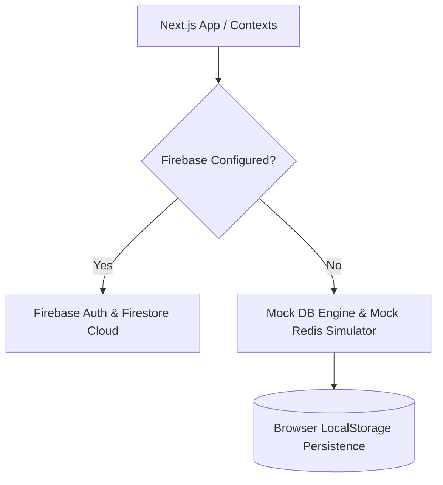

# 🎓 AlumniPortal: Enterprise-Grade Alumni Connection & Networking Network

[](https://nextjs.org)
[](https://react.dev)
[](https://www.typescriptlang.org)
[](https://tailwindcss.com)
[](https://firebase.google.com)
[](https://razorpay.com)

Welcome to **AlumniPortal**, a premium, high-performance web application engineered to bridge the gap between academic institutions, graduating students, and global alumni networks. 

Designed with a sleek **dark-mode glassmorphic interface**, it showcases robust engineering patterns: a dual-adapter hybrid database system, custom sliding-window rate limiters, atomic seat reservation counters, sorted set waitlists, and secure payment processing.

---

## 🛠️ Core Capabilities & Features

### 👥 1. Filterable Alumni Directory
* **Advanced Queries**: Search and discover alumni through multi-criteria filters including graduation batch, engineering discipline, current corporate employer, and technical skills.
* **Mentorship Connections**: Quick social link integrations (GitHub, LinkedIn, Twitter, Instagram) for frictionless mentorship check-ins.

### 📅 2. Event Planner & Ticket Generator (with QR Passes)
* **Real-time Seating**: Tracks event seat availability atomically using custom server-side simulation.
* **Activity & Diet Configuration**: Register for custom breakout activities and select dietary preferences (Veg/Non-Veg).
* **Automated Ticketing**: Generates a secure, digital entry ticket complete with a cryptographically simulated QR verification token for instant check-ins.

### 💬 3. Interactive Memory Wall
* **Peer Engagement**: Share photos, describe memories, and interact via a chronological feed.
* **Real-time Interaction**: Supports active, instantaneous liking and nested comment threads for interactive discussions.

### 💼 4. Job Board & Referrals
* **Career Board**: Alumni can post internal job opportunities, internships, or contract roles.
* **Referral System**: Highlights opportunities where alumni are available to refer candidates internally, bypassing generic screening channels.

### 💳 5. Secure Contribution & Donation Gateway
* **Razorpay API Integration**: Fully integrates with Razorpay for secure alumni contributions.
* **Backend Orders**: Implements a Next.js API route (`/api/razorpay/order`) with HTTP Basic Authentication, converting INR to Paise and generating secure order transactions.

### 🛡️ 6. Verification Quarantine & Admin Panel
* **Quarantine Security**: Newly registered accounts enter a quarantined state. Users are restricted to a pending verification layout until approved.
* **Admin Controls**: Dedicated dashboard panel for administrative coordinators to toggle user activation, create events, inspect transactions, and monitor platform metrics.

---

## 🏗️ Architectural Masterpiece: Hybrid Data Layer & Mock Redis Engine

To support zero-configuration local runs and seamless production scaling, the app implements a **dual-adapter architecture**:



### 1. Dual-Adapter Auth & Data Provider
Located in [`AuthContext.tsx`](src/context/AuthContext.tsx), the application automatically checks for environment variables.
* **Firestore Adapter**: Communicates directly with Firebase Authentication, Firestore DB, and Cloud Storage.
* **Mock DB Adapter**: Backed by [`mockDb.ts`](src/lib/mockDb.ts), it intercepts all operations and persists state inside the browser's `LocalStorage`. This includes transaction logs, comment increments, and user record changes.

### 2. Mock Redis Cache Engine ([`mockRedis.ts`](src/lib/mockRedis.ts))
To demonstrate production-ready architectural concepts, we built a virtual Redis layer in LocalStorage simulating advanced Redis commands:
* **Key-Value Cache with TTL (Time-To-Live)**: Automatically purges cache records after their expiration timestamp is reached.
* **Atomic Decrementing (`DECR`)**: Safely decrements event capacities when a user books a seat, ensuring zero double-bookings.
* **Sorted Sets (`ZSET`)**: Simulates priority waitlists. If event capacities are filled, applicants are queued in a sorted set ordered by registration timestamp (`score`).
* **Sliding Window Log Rate Limiter**: Throttles route access by keeping a chronological log of IP-based timestamps. It allows a set threshold (e.g., maximum 20 requests per 60-second window) and rejects excessive traffic with HTTP 429 status simulation.

---

## 💻 Technology Stack & Libraries

* **Core**: Next.js 16.2.7 (Turbopack), React 19.2.4, TypeScript 5
* **Styling**: Tailwind CSS v4 (incorporating HSL-tailored colors, smooth animations, and glassmorphism styling)
* **Icons**: Lucide React
* **QR Codes**: `qrcode` generator library
* **Third-Party Integrations**: Firebase Client SDK, Razorpay Web checkout APIs

---

## 🚀 Installation & Local Run

Follow these steps to spin up the project on your local machine:

### 1. Clone the Repository & Install Dependencies
```bash
npm install
```

### 2. Set Up Environment Variables
Copy `.env.example` to `.env` in the root directory:
```bash
cp .env.example .env
```
Fill in the credentials if you wish to connect to live services:
* **Firebase**: Fill in `NEXT_PUBLIC_FIREBASE_` parameters to enable live Auth/Firestore database.
* **Razorpay**: Set your credentials to enable checkout transactions.

> [!NOTE]
> If these environment variables are left blank, the application **automatically enters Mock Mode** with full functionality!

### 3. Run the Development Server
```bash
npm run dev
```
Open **[http://localhost:3000](http://localhost:3000)** in your browser.

---

## 🔑 Test Credentials (Mock Mode)

When running in Mock Mode, you can log in using these pre-configured user credentials:

| Role | Email | Password | Features Unlocked |
|---|---|---|---|
| **Alumni Coordinator (Admin)** | `admin@alumni.portal` | *Any value* | Event creation, User approval panel, Transaction logs, Platform metrics |
| **Sarah Chen (Alumni)** | `sarah.chen@gmail.com` | *Any value* | Job postings, Profile modifications, QR Event booking, Memory posting |

---

## 🔍 Key Interview Discussion Topics

* **Offline-First Resilience**: How the application maintains a functional UI state even if network endpoints or Firebase configs fail.
* **State Synchronization**: Using Context-based state dispatchers to sync LocalStorage changes across multiple browser tabs.
* **Atomic Counter Integrity**: The challenge of managing shared resources (like event seating) and simulating concurrency controls.
* **Tailwind v4 Integration**: Leveraging the updated Tailwind compilation engine for ultra-fast builds and CSS-first config structures.
